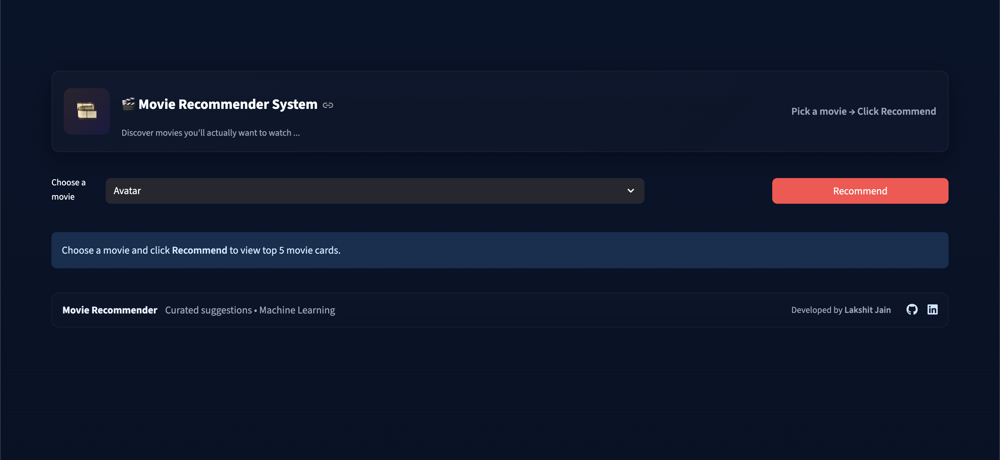
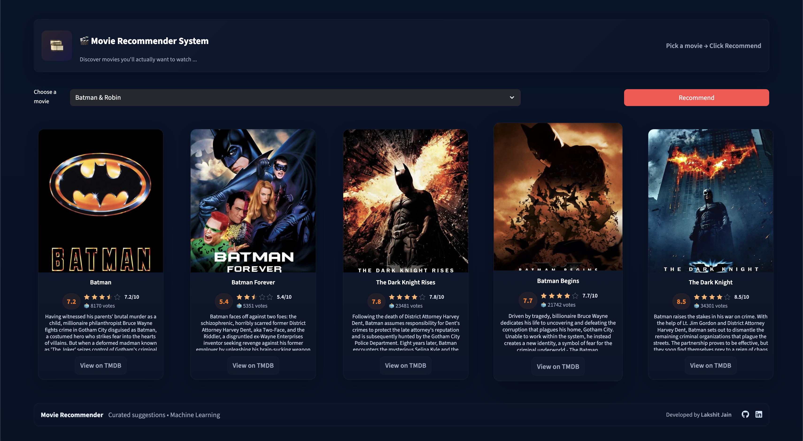

<!-- Banner Image -->
<p align="center">
   
</p>

<p align="center">
   
   
   
   
</p>

# 🎬 Movie Recommender System

> **A modern, interactive web app to discover movies you'll love, powered by content-based machine learning and the TMDB dataset.**

---

## 📑 Table of Contents

- [Project Description](#project-description)
- [Tech Stack](#tech-stack)
- [Visuals](#visuals)
- [Getting Started](#getting-started)
- [Project Structure](#project-structure)
- [Dataset](#dataset)
- [How it Works](#how-it-works)
- [Usage](#usage)
- [Contributing](#contributing)
- [Contact](#contact)
- [License](#license)
- [Acknowledgments](#acknowledgments)

---

## 📝 Project Description

The **Movie Recommender System** is a web application that helps users find movies similar to their favorites using content-based filtering. Leveraging the TMDB 5000 Movie Dataset, it analyzes genres, keywords, cast, and crew to suggest relevant movies. The app features a clean UI, real-time recommendations, and direct links to TMDB for more details.

**Key Features:**

- 🔍 Search and select any movie from the dataset
- 🤖 Get top 5 similar movie recommendations instantly
- 🖼️ View posters, ratings, overviews, and TMDB links
- ⚡ Fast, interactive, and visually appealing Streamlit UI

---

## 🛠️ Tech Stack

- **Frontend/UI:** [Streamlit](https://streamlit.io/)
- **Backend/Logic:** Python 3, Content-Based Filtering
- **ML Libraries:** scikit-learn, pickle
- **API:** TMDB API (for posters, ratings, overviews)
- **Data Handling:** pandas, ast, requests
- **Environment:** python-dotenv, virtualenv/venv

---

## 🖼️ Visuals

<p align="center">
   
   
</p>

---

## 🚀 Getting Started

### 1. **Clone the Repository**

```bash
git clone https://github.com/lakshitcodes/Movie-Recommender-System.git
cd Movie-Recommender-System
```

### 2. **Install Dependencies**

```bash
python3 -m venv venv
source venv/bin/activate
pip install -r requirements.txt
```

### 3. **Set Up Environment Variables**

Create a `.env` file in the root directory:

```env
TMDB_API_KEY=your_tmdb_api_key_here
```

### 4. **Prepare the Data**

- Download the TMDB 5000 Movie Dataset from [Kaggle](https://www.kaggle.com/datasets/tmdb/tmdb-movie-metadata).
- Place `tmdb_5000_movies.csv` and `tmdb_5000_credits.csv` in the `data/` folder.
- Run all cells in `movie-recommender-system.ipynb` to generate `movies.pkl` and `similarity.pkl`.

### 5. **Run the App**

```bash
streamlit run app.py
```

Open the provided local URL in your browser.

---

## 📁 Project Structure

```plaintext
.
├── app.py                  # Main Streamlit app
├── movie-recommender-system.ipynb  # Data processing & model notebook
├── movies.pkl              # Processed movie data (generated)
├── similarity.pkl          # Similarity matrix (generated)
├── data/
│   ├── tmdb_5000_movies.csv
│   └── tmdb_5000_credits.csv
├── images/
│   ├── image.png           # UI screenshot
│   └── image-1.png         # Recommendation output
├── .env                    # API keys (not committed)
└── README.md
```

---

## 📊 Dataset

- **Source:** [Kaggle - TMDB 5000 Movie Dataset](https://www.kaggle.com/datasets/tmdb/tmdb-movie-metadata)
- **Files Used:** `tmdb_5000_movies.csv`, `tmdb_5000_credits.csv`
- **Key Columns:** Genres, keywords, cast, crew, overview, title, movie_id
- **License:** Refer to [Kaggle dataset license](https://www.kaggle.com/datasets/tmdb/tmdb-movie-metadata)

---

## ⚙️ How it Works

<details>
<summary>Click to expand the ML pipeline</summary>

1. **Data Merging:** Combine movies and credits datasets on `movie_id`.
2. **Preprocessing:** Extract and clean genres, keywords, cast, and crew. Normalize multi-word genres (e.g., `Science Fiction` → `ScienceFiction`).
3. **Tag Creation:** Concatenate overview, genres, keywords, cast, and crew into a single string per movie.
4. **Text Vectorization:** Use `CountVectorizer` to convert tags into vectors (max 5000 features, English stopwords removed).
5. **Similarity Calculation:** Compute cosine similarity between movie vectors.
6. **Recommendation:** For a selected movie, retrieve the top 5 most similar movies (excluding itself).
7. **UI & API:** Display results with posters, ratings, and links using TMDB API.

</details>

---

## 💡 Usage

- **Select a movie** from the dropdown.
- **Click "Recommend"** to get similar movies.
- **View details:** Poster, rating, overview, and a direct link to TMDB.

**Example:**

> Input: `Inception`  
> Output: 5 similar movies with posters, ratings, and overviews.

---

## 🤝 Contributing

Contributions are welcome!

1. Fork the repo
2. Create a new branch (`git checkout -b feature/your-feature`)
3. Commit your changes
4. Open a Pull Request

Please see [CONTRIBUTING.md](CONTRIBUTING.md) for more details.

---

## 📬 Contact

- **LinkedIn:** [Lakshit Jain](https://www.linkedin.com/in/lakshitcodes/)
- **Portfolio:** [lakshitcodes.github.io](https://lakshitcodes.github.io/)
- **Email:** lakshitjain2002@gmail.com

---

## 📝 License

This project is licensed under the [MIT License](LICENSE).

---

## 🙏 Acknowledgments

- [TMDB](https://www.themoviedb.org/) for the dataset and API
- [Kaggle](https://www.kaggle.com/datasets/tmdb/tmdb-movie-metadata) for data hosting
- [Streamlit](https://streamlit.io/) for the web framework

---
